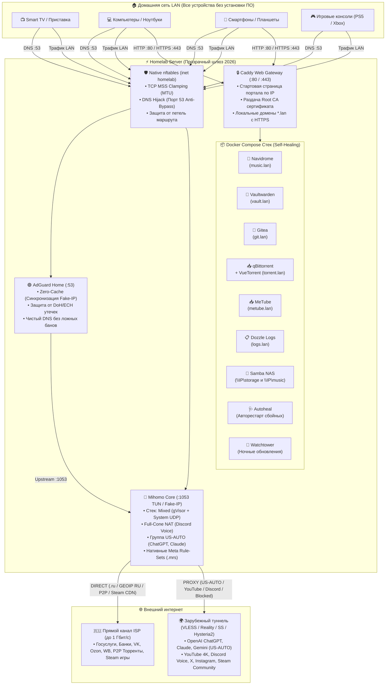

# 🛡️ Homelab Appliance & Transparent Gateway
### 🇷🇺 Russia Pro Edition 2026 • Умный прозрачный шлюз и автономная домашняя станция

<p align="center">
  
  
  
  
  
  
  
  
</p>

```text
  ███╗   ███╗███████╗██████╗  █████╗ ██╗     
  ████╗ ████║██╔════╝██╔══██╗██╔══██╗██║     
  ██╔████╔██║█████╗  ██║  ██║███████║██║     
  ██║╚██╔╝██║██╔══╝  ██║  ██║██╔══██║██║     
  ██║ ╚═╝ ██║███████╗██████╔╝██║  ██║███████╗
  ╚═╝     ╚═╝╚══════╝╚═════╝ ╚═╝  ╚═╝╚══════╝
  ╔══════════════════════════════════════════════════════════════════════════════╗
  ║   HOMELAB APPLIANCE & TRANSPARENT GATEWAY ◈ RUSSIA PRO 2026 EDITION          ║
  ╠══════════════════════════════════════════════════════════════════════════════╣
  ║  ◆ ПРОЗРАЧНЫЙ СЕТЕВОЙ ШЛЮЗ: MIHOMO TUN + ADGUARD HOME (CLEAN DNS)            ║
  ║                                                                              ║
  ║   [ КЛИЕНТЫ LAN ] ──► [ ADGUARD :53 ] ──► [ MIHOMO TUN :1053 ]               ║
  ║   (ТВ, ПК, Смартфоны)  ZeroCache/DNS-Hijack Fake-IP / Mixed TUN / gVisor     ║
  ║           │                     │                                            ║
  ║           │                     ▼ (Анти-Утечки)   Маршрутизация трафика:     ║
  ║           │              [ ECH / DOH DROP ]  ├─► [ US-AUTO ] AI (ChatGPT)    ║
  ║           │                                  ├─► [ PROXY ] YT, Discord, X    ║
  ║           │                                  ├─► [ STEAM ] Комьюнити / Прокси║
  ║           │                                  └─► [ DIRECT ] РФ / Банки / P2P ║
  ║           ▼                                                      │           ║
  ║   [ ПРЯМОЙ ВЫХОД ] ──────────────────────────────────────────────┘           ║
  ║   • Умный Fake-IP DNS + nftables: Прозрачный обход без настройки клиентов    ║
  ╚══════════════════════════════════════════════════════════════════════════════╝
```

---

## 🌟 Что это такое?

**Homelab Appliance & Transparent Gateway** — это автономная инженерная система «всё-в-одном» для домашнего сервера, мини-ПК (Intel N100, Raspberry Pi 4/5, Orange Pi, старый ПК, локальная ВМ или контейнер Proxmox).

Комплекс превращает сервер в **аппаратный прозрачный шлюз маршрутизации** и **персональное домашнее облако**, решая главные проблемы домашней сети в России 2026 года:

1. **Свободный интернет без настройки клиентских устройств:** На смартфонах, телевизорах и компьютерах больше **не нужно** ставить VPN-приложения, включать расширения в браузерах или разряжать аккумулятор. Вся домашняя сеть фильтруется и маршрутизируется прозрачно.
2. **Личные облачные сервисы без абонентской платы:** Собственный Hi-Fi стриминг музыки с офлайн-кэшем для метро (Navidrome), комбайн скачивания медиаконтента (MeTube), персональный менеджер паролей (Vaultwarden), домашний Git-сервер (Gitea), изолированная торрент-качалка (qBittorrent VueTorrent) и сетевое хранилище Samba NAS.

---

## 🎯 Принцип «Одного действия» (1 клик для всей квартиры)

Забудьте об установке и настройке софта на устройствах каждого члена семьи:

> [!IMPORTANT]
> Вы указываете IP-адрес этого сервера как **Основной шлюз (Gateway)** и **DNS-сервер** ровно **один раз в настройках DHCP домашнего роутера** (Keenetic, MikroTik, ASUS, OpenWrt, TP-Link).
> После этого **все устройства** (Smart TV, Apple TV, PlayStation, iPhone, Android, ПК, ноутбуки, умный дом) автоматически получают доступ к YouTube 4K, Discord Voice, ChatGPT, защищенным сайтам и доменам `*.lan`!

---

## ⚡ Архитектура и вызовы РФ в 2026 году

Большинство стандартных VPN-решений в России либо ломают Госуслуги и банковские приложения, либо вызывают бесконечную буферизацию YouTube из-за замедлений ТСПУ. Наш комплекс решает каждую из этих проблем на уровне сетевого ядра:

| Вызов в РФ (РКН / ТСПУ) | Инженерное решение в комплексе |
| :--- | :--- |
| **YouTube 4K & Google CDN** | **Mihomo TUN Mixed-Stack & Anti-Throttling:** Трафик YouTube и `*.googlevideo.com` направляется в оптимизированный туннель. Активирован автоматический сброс замедленного QUIC (порт UDP 443 дропается для заблокированных ресурсов), что принуждает браузеры переходить на сверхбыстрый TCP/TLS без потери пакетов. |
| **Голосовая связь Discord & Игры** | **Full-Cone NAT & gVisor Mixed Stack:** Полная поддержка UDP-трафика и голосовых серверов Discord Voice без односторонней слышимости и зависаний на «Connecting RTC». |
| **Геоблокировки AI (ChatGPT, Claude, Gemini)** | **Динамическая группа `US-AUTO`:** Алгоритм автоматически отбирает в вашей подписке американские узлы (`(?i)\b(US|USA|United States|America)\b|🇺🇸|США`) и пингует их каждые 5 минут, направляя трафик нейросетей на самый быстрый сервер США. Никаких «Access Denied» из-за случайной европейской ноды. |
| **Госуслуги, Банки, Кинопоиск, VK, Доставка** | **100% Прямой выход (DIRECT):** Все зоны `.ru`, `.su`, `.рф`, реестры `category-ru` и гео-базы российских подсетей выведены в нативный bypass на полной скорости провайдера (до 1 Гбит/с, без капч и ограничений). |
| **Личный Spotify для авто и метро** | **Триада Navidrome + MeTube + Samba:** Сервер стриминга Hi-Fi аудио (~40 МБ ОЗУ). Скачиваете треки или плейлисты через MeTube ➔ треки индексируются в `/music` ➔ нативные приложения **Symfonium** (Android), **Substreamer** (iOS) и **Feishin** (ПК) дают 100% офлайн-кэш, тексты песен в такт, CarPlay и Android Auto. |
| **P2P-торренты без сжигания трафика прокси** | Трафик пиров BitTorrent (порты 6881–6889, 51413) изолирован и идет **напрямую**, не нагружая зарубежный VPS. При этом заблокированные трекеры (RuTracker, Rutor, Flibusta, NNMClub) прозрачно проксируются. |
| **Steam: Сообщество против загрузки игр** | Сообщество Steam (`steamcommunity.com`) проксируется для открытия профилей и инвентаря, а гигабайты игровых дистрибутивов (`steam_site`) качаются напрямую на полной скорости провайдера. |
| **Утечки DNS на Smart TV и приставках** | **Native DNS Hijacking в nftables:** Любые скрытые DNS-запросы на порт 53 (даже если телевизор захардкодил `8.8.8.8` или `1.1.1.1`) на лету перехватываются и направляются в AdGuard Home. |
| **Блокировки ECH со стороны ТСПУ** | В AdGuard Home активированы `block_ech: true` и фильтр `|*^$dnstype=HTTPS`. Это предотвращает невидимый сброс TLS-соединений на ресурсах Cloudflare. |
| **Скрытый обход шлюза через Apple iCloud** | Встроена канареечная блокировка `mask.icloud.com` и `mask-h2.icloud.com`. Техника Apple видит домашний шлюз и корректно использует его, не уходя во встроенный обход. |
| **Автономный DoH в браузерах** | Блокировка канареечного домена `use-application-dns.net`. Браузеры Chrome и Firefox уважают настройки домашней сети и не уводят запросы мимо шлюза. |
| **Зависания страниц на PPPoE/L2TP** | **TCP MSS Clamping (`rt mtu`) в nftables:** Пакеты автоматически подгоняются под MTU провайдера, предотвращая фрагментацию и «залипание» сайтов. |

---

## 🏗️ Интерактивная схема движения трафика



---

## 🌐 Каталог встроенных веб-сервисов

Сервер полностью готов к работе сразу после завершения работы установщика:

| Служба | Локальный домен | Назначение | Доступ / Авторизация |
| :--- | :--- | :--- | :--- |
| **Портал навигации** | `http://<IP-сервера>/` | Главный дашборд со ссылками на все службы и кнопкой скачивания Root CA | Открытый (LAN) |
| **Navidrome Music** | `https://music.lan` | Музыкальный Hi-Fi стриминг (OpenSubsonic API, тексты песен, обложки) | Создание админа при первом входе |
| **MeTube Downloader** | `https://metube.lan` | Загрузка видео и аудио с YouTube, VK, RuTube, TikTok (ночной yt-dlp) | Открытый (LAN) |
| **AdGuard Home** | `https://adguard.lan` | Панель DNS-сервера, статистика блокировок, белые/черные списки | `admin` / Мастер-пароль |
| **Mihomo Web UI** | `https://proxy.lan` | Панель MetaCubeXD: задержки нод, переключение прокси, объем трафика | Секрет (Мастер-пароль) |
| **Vaultwarden** | `https://vault.lan` | Персональный менеджер паролей (совместим с приложениями Bitwarden) | Личная регистрация + `/admin` токен |
| **Gitea** | `https://git.lan` | Персональный Git-сервер (SSH порт `2222`, веб-интерфейс, Webhooks) | `admin` / Мастер-пароль |
| **qBittorrent** | `https://torrent.lan` | Торрент-клиент с интерфейсом **VueTorrent** и прямым P2P-выходом | `admin` / Мастер-пароль |
| **Dozzle Logs** | `https://logs.lan` | Просмотр живых логов всех Docker-контейнеров в реальном времени | `admin` / Мастер-пароль |
| **Samba (Хранилище)** | `\\<IP>\storage` | Сетевая папка Windows / Mac / Android TV (авто-дискавери WSDD2) | `admin` / Мастер-пароль |
| **Samba (Медиатека)** | `\\<IP>\music` | Прямой доступ к медиатеке Navidrome для закидывания треков с ПК | `admin` / Мастер-пароль |

*(При выборе SSL-режима DuckDNS вместо `.lan` используются адреса вида `*.ваш-домен.duckdns.org`)*

---

## 🚀 Быстрый старт: Установка в 1 команду

### Системные требования:
* **Поддерживаемые ОС:** Debian 12/13, Ubuntu 24.04/26.04 LTS, Arch Linux, Alpine Linux v3.19+ (OpenRC).
* **Архитектура процессора:** `x86_64` (Intel/AMD) или `aarch64` (ARM64, Raspberry Pi 4/5, Orange Pi).
* **ОЗУ:** от **1 ГБ** (установщик автоматически подключает легковесный zRAM-своп с компрессией `zstd`).
* **Права:** `root` (или запуск через `sudo`).

### Запуск установщика:
Выполните одну команду в терминале вашего сервера:

```bash
curl -fsSL https://raw.githubusercontent.com/unknownpeace/Medal/main/install.sh | sudo bash
```

> [!TIP]
> **Для минимальной Alpine Linux:** Если на чистом Alpine отсутствует `curl`, установите его либо запустите установщик через стандартный `wget`:
> ```bash
> apk add --no-cache curl bash
> curl -fsSL https://raw.githubusercontent.com/unknownpeace/Medal/main/install.sh | bash
> ```

---

## ⚡ Наблюдаемость и Профайлер (v2.8.16)

В релизе **v2.8.16** комплекс оснащен промышленной системой логирования, профилирования и сбора аварийных дампов:

### 1. Двухуровневый логгер ядра (`install.log`)
* Полный технический журнал развертывания и обновлений непрерывно пишется в:
  * `/var/log/homelab-install.log`
  * Симлинк: `/opt/homelab/install.log`
* Все сообщения форматируются с микросекундными таймштампами `[YYYY-MM-DD HH:MM:SS] [LEVEL]`, при этом ANSI-цвета очищаются для чистоты файла.
* Предыдущий лог автоматически сохраняется в `.prev` при каждом запуске.

### 2. Встроенный Step Profiler & Bottleneck Detector
* Установщик замеряет точную длительность каждого из 11 этапов развертывания с помощью системных таймеров `$SECONDS`.
* В конце выводится таблица таймингов с автоматической подсветкой самого долгого этапа (`[TOP 1 / УЗКОЕ МЕСТО]`), что позволяет мгновенно понять, куда уходит время:
  ```text
  ╭── ТАЙМИНГИ И ПРОФИЛИРОВАНИЕ РАЗВЕРТЫВАНИЯ ──────────────────────╮
  │  • [01/11] УСТАНОВКА ЗАВИСИМОСТЕЙ И СТЕКА DOCKER    1 сек
  │  • [02/11] ИНТЕЛЛЕКТУАЛЬНЫЙ АНАЛИЗ СЕТЕВОГО ОКРУЖЕНИЯ    3 сек
  │  • [06/11] СТРУКТУРА КАТАЛОГОВ И ОПТИМИЗАЦИЯ ХРАНИЛИЩА  19 сек
  │  • [10/11] РЕЗЕРВНОЕ КОПИРОВАНИЕ, СТАРТ И ИНИЦИАЛИЗАЦИЯ 97 сек [TOP 1 / УЗКОЕ МЕСТО]
  ├─────────────────────────────────────────────────────────────────┤
  │  ⚡ Общее время:       2 мин 50 сек (170 сек)
  │  ✦ Журнал развертывания: /opt/homelab/install.log
  ╰─────────────────────────────────────────────────────────────────╯
  ```

### 3. Автоматический аварийный дамп (Crash Report)
Если на сервере закончится память или пропадет интернет во время сборки, перехватчик `trap ERR` создаст структурированный Crash Report с полным снимком системы:
* Номер строки и точная упавшая команда.
* Стек вызовов функций (`FUNCNAME[*]`).
* Состояние ОЗУ (`free -m`), свободное место на дисках (`df -h`), нагрузка (`uptime`).
* Последние строки вывода фонового спиннера.

---

## 📱 Настройка роутера (1 действие для всего дома)

Когда скрипт завершит работу и выведет финальный дашборд:

1. Откройте веб-панель управления вашего домашнего роутера (**Keenetic**, **MikroTik**, **ASUS**, **OpenWrt**, **TP-Link**).
2. Перейдите в раздел **DHCP / Домашняя сеть (LAN)**.
3. Укажите:
   * **Основной шлюз (Default Gateway):** `IP-адрес вашего Homelab-сервера`
   * **Первичный DNS-сервер (Primary DNS):** `IP-адрес вашего Homelab-сервера`
4. Нажмите «Применить» и переподключите Wi-Fi на устройствах.

**Готово!** С этого момента все ваши телевизоры, телефоны, ПК и консоли пользуются быстрым интернетом без рекламы и блокировок.

---

## 🔒 Доверие локальным SSL-сертификатам

При работе с локальными доменами `.lan` сервер автоматически выпускает персональный корневой сертификат (Root CA). Чтобы браузеры показывали «зеленый замочек» без предупреждений:

1. Откройте в браузере стартовую страницу: `http://<IP-сервера>/`
2. Нажмите кнопку **«📥 Скачать Root CA Сертификат (caddy-root.crt)»**.
3. Добавьте его в доверенные корневые центры:
   * **Windows:** Дважды кликните по файлу `.crt` &rarr; «Установить сертификат» &rarr; «Текущий пользователь» &rarr; «Поместить в хранилище» &rarr; **«Доверенные корневые центры сертификации»**.
   * **iOS / iPadOS:** Скачайте профиль &rarr; «Настройки» &rarr; «Профиль загружен» &rarr; «Установить» &rarr; «Основные» &rarr; «Об этом устройстве» &rarr; «Доверие сертификатам» &rarr; включите тумблер для Caddy Root CA.
   * **Android:** «Настройки» &rarr; «Безопасность» &rarr; «Установка сертификатов» &rarr; «Сертификат CA».

---

## 🎵 Личный Spotify: Hi-Fi Музыкальный стриминг

Аудиосервер **Navidrome** потребляет всего **~40 МБ ОЗУ** и совместим с открытым протоколом **OpenSubsonic API**.

### 🔄 Бесшовный конвейер музыки:
1. **Скачивание через MeTube (`https://metube.lan`):** Вставьте ссылку на трек, плейлист или альбом из YouTube Music, VK, RuTube или SoundCloud — MeTube скачает аудио в максимальном качестве прямо в `/music`.
2. **Lossless FLAC с торрентов:** Качайте альбомы через qBittorrent прямо в папку `\\<IP>\music`.
3. **Копирование по сети:** Перетаскивайте аудиофайлы со своего ПК через проводник Windows или macOS Finder по Samba.

### 📱 Подключение приложений:
| Платформа | Рекомендуемое приложение | Возможности |
| :--- | :--- | :--- |
| **Android** | 👑 **Symfonium** *(или Tempo / Substreamer)* | **100% Офлайн-кэш** в память смартфона (для метро и самолёта), **Android Auto**, караоке-тексты песен в такт музыке, 10-полосный эквалайзер, Material You дизайн. |
| **iOS (iPhone/iPad)** | 👑 **Substreamer** *(или play:Sub / Amperfy)* | Интерфейс **точь-в-точь как Spotify**, тёмная тема, поддержка **Apple CarPlay**, офлайн-загрузка, кэширование. |
| **ПК (Win/Mac/Linux)** | 👑 **Feishin** *([GitHub](https://github.com/feishin/feishin))* | Премиальный десктопный плеер на базе движка MPV. Поддержка медиа-клавиш и Discord Rich Presence («Слушает в Navidrome»). |

> **Параметры входа в приложении:**  
> • Сервер: `https://music.lan`  
> • Логин: `admin`  
> • Пароль: ваш мастер-пароль

---

## 🍪 Обход ограничений YouTube: Cookies в MeTube

Для загрузки приватных плейлистов, контента 18+ и обхода защиты SABR в YouTube предусмотрено простое управление cookies:

```bash
# Интерактивная вставка cookies прямо в консоль:
homelab cookies --paste

# Либо загрузка готового файла cookies.txt:
homelab cookies /путь/к/cookies.txt

# Очистка сохраненных cookies:
homelab cookies clear
```

---

## 🛠️ Единая утилита управления `homelab`

После установки на сервере доступна глобальная консольная утилита:

```bash
homelab [КОМАНДА] [ПАРАМЕТРЫ]
```

### Справочник команд:
| Команда | Описание |
| :--- | :--- |
| `homelab status` | Дашборд состояния сервера, памяти, накопителей, nftables и контейнеров |
| `homelab doctor` | Комплексная самодиагностика DNS (53), Fake-IP (1053), TUN, MSS и API |
| `homelab install-log [-f]` | Просмотр журнала развертывания и таймингов профайлера (с ключом `-f` в реалтайме) |
| `homelab dump-logs [файл]` | Сборка логов всех контейнеров, системы и установщика в единый файл |
| `homelab upgrade [--force]`| Бесшовное обновление ядра комплекса из GitHub (OTA In-Place Update) |
| `homelab rollback` | Мгновенный откат к предыдущей версии ядра из снимка восстановления |
| `homelab version` | Проверка установленной версии ядра и наличия новых релизов на GitHub |
| `homelab restart [сервис]` | Перезапуск всего комплекса или отдельного контейнера (`mihomo`, `caddy`, `metube`...) |
| `homelab logs [сервис] -f` | Просмотр живых логов службы в терминале в реальном времени |
| `homelab backup` | Мгновенный горячий бэкап баз данных SQLite (Vaultwarden, Gitea) |
| `homelab cookies [файл]` | Управление cookies YouTube для MeTube (yt-dlp) |
| `homelab notify [текст]` | Отправка тестового оповещения в Telegram |
| `homelab update` | Безопасное обновление всех Docker-образов комплекса до latest |
| `homelab unlock` | Ручная разблокировка шифрованного диска LUKS2 |

---

## 🧩 Модульная архитектура исходного кода

Проект спроектирован по принципу модульного компилятора: исходные компоненты разделены по функциональным файлам в `src/`, а сборщик `build.sh` компилирует их в готовый монолитный `install.sh`:

```text
.
├── VERSION                   # 🏷️ Версия релиза комплекса (например, 2.8.16)
├── build.sh                  # 🔨 Компилятор/бандлер (собирает src/*.sh в install.sh)
├── install.sh                # 🚀 Готовый автономный установщик (для развертывания в 1 команду)
├── README.md                 # 📖 Документация проекта
└── src/                      # 📂 Исходные модули комплекса:
    ├── 00_header.sh          # Палитра цветов, логгер install.log, спиннер run_spin, crash-dump
    ├── 01_system.sh          # Баннер, детекция CPU/RAM/OS, синхронизация времени
    ├── 02_packages.sh        # Пакетный менеджер, Docker CE (зеркала РФ), zRAM
    ├── 03_network.sh         # Анализ сети (IP, шлюз, подсеть, интерфейс)
    ├── 04_config.sh          # Интерактивный мастер настроек (Express / Custom / Reset)
    ├── 05_gateway.sh         # Твики ядра (sysctl, BBR), nftables (inet homelab), watchdog
    ├── 06_directories.sh     # Создание каталогов, No-COW (+C), предзагрузка MRS-правил и UI
    ├── 07_dns_bench.sh       # Параллельный DoH/DoT бенчмарк апстримов с гео-приоритетом
    ├── 08_services_conf.sh   # Генерация AdGuardHome.yaml (Schema 34+) и mihomo/config.yaml
    ├── 09_compose_caddy.sh   # Генерация Caddyfile (с лендингом и CA) и compose.yaml
    ├── 10_backups_cli.sh     # Служба авто-бэкапов, homelab CLI, doctor и install-log
    └── 11_diagnostics.sh     # Самодиагностика, показ профилирования и итоговый дашборд
```

### Как разрабатывать и вносить изменения:
1. Отредактируйте нужный модуль внутри каталога `src/`.
2. Запустите компилятор сборки:
   ```bash
   ./build.sh
   ```
3. Зафиксируйте изменения в Git:
   ```bash
   git add -A
   git commit -m "feat: описание ваших доработок"
   git push origin main
   ```
После этого при выполнении команды `homelab upgrade` или однострочника установки на любом сервере автоматически применится ваша свежая сборка!

---

## 💾 Оптимизация дискового пространства и баз данных

* **Btrfs No-COW (`chattr +C`):** На файловых системах Btrfs скрипт автоматически отключает Copy-on-Write на каталогах баз данных SQLite (Vaultwarden, Gitea, AdGuard Home) и папке загрузок qBittorrent. Это исключает фрагментацию и бережет ресурс SSD.
* **Шифрование LUKS2 с Argon2id:** В кастомном режиме поддерживается создание защищенного блочного раздела (`cryptsetup luksFormat --type luks2 --pbkdf argon2id`) с утилитой ручной и автоматической разблокировки.
* **Ротация логов Docker:** Для защиты от переполнения диска в `/etc/docker/daemon.json` включена ротация (`max-size: 10m`, `max-file: 3`), а системный журнал `systemd-journald` ограничен до 100 МБ.
* **Горячие резервные копии:** Каждую ночь создаются онлайн-снимки баз данных через потоковый SQLite Backup API со складированием архивов в защищённую директорию хранилища с ротацией 14 дней.

---

## 📄 Лицензия

Проект распространяется под свободной лицензией **MIT**. Подробности в файле [LICENSE](LICENSE).
