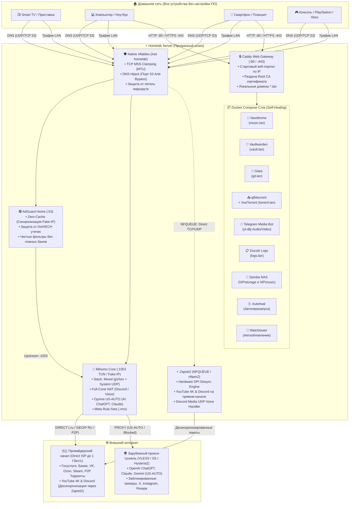

# 🛡️ Homelab Appliance & Transparent Gateway
### 🇷🇺 Russia Pro Edition • Отказоустойчивый домашний сервер и прозрачный шлюз 2026

<p align="center">
  
  
  
  
  
  
  
</p>

```text
  ███╗   ███╗███████╗██████╗  █████╗ ██╗     
  ████╗ ████║██╔════╝██╔══██╗██╔══██╗██║     
  ██╔████╔██║█████╗  ██║  ██║███████║██║     
  ██║╚██╔╝██║██╔══╝  ██║  ██║██╔══██║██║     
  ██║ ╚═╝ ██║███████╗██████╔╝██║  ██║███████╗
  ╚═╝     ╚═╝╚══════╝╚═════╝ ╚═╝  ╚═╝╚══════╝
  ╔══════════════════════════════════════════════════════════════════════════╗
  ║   HOMELAB APPLIANCE & TRANSPARENT GATEWAY ◈ RUSSIA PRO 2026 EDITION      ║
  ╠══════════════════════════════════════════════════════════════════════════╣
  ║  ◆ ГИБРИДНЫЙ СЕТЕВОЙ СТЕК: ZAPRET2 + MIHOMO TUN + ADGUARD HOME (CLEAN)   ║
  ║                                                                          ║
  ║   [ КЛИЕНТЫ LAN ] ──► [ ADGUARD :53 ] ──► [ MIHOMO TUN :1053 ]           ║
  ║   (ТВ, ПК, Смартфоны)  CleanDNS/ZeroCache   Fake-IP / Mixed TUN / gVisor ║
  ║           │                     │                                        ║
  ║           │                     ▼ (Анти-Утечки)   Маршрутизация трафика: ║
  ║           │              [ ECH / DOH DROP ]  ├─► [ US-AUTO ] AI (ChatGPT)║
  ║           │                                  ├─► [ PROXY ] Зарубежное    ║
  ║           │                                  └─► [ DIRECT ] РФ / Банки   ║
  ║           ▼                                                      │       ║
  ║   [ ZAPRET2 ENGINE ] ────────────────────────────────────────────┘       ║
  ║   • NFQUEUE / nfqws2: Аппаратный DPI-Bypass для ВСЕХ сайтов прямо        ║
  ║     через провайдера без VPN (YouTube 4K, Discord, Pixiv, Rutracker)!    ║
  ║   • Работает автономно ДАЖЕ ЕСЛИ НЕ УКАЗАНА ПОДПИСКА НА ПРОКСИ!          ║
  ╚══════════════════════════════════════════════════════════════════════════╝
```

---

## 💡 Что это такое?

**Homelab Appliance & Transparent Gateway** — это готовый программный комплекс «всё-в-одном» для домашнего сервера или мини-ПК (Intel N100, Raspberry Pi, Orange Pi, старый ПК, VPS), превращающий его в **умный сетевой шлюз и защищённый медиа-сервер**.

### 🎯 Принцип «Одного действия»
Вам больше **не нужно** ставить VPN-клиенты, расширения или костыли на каждый телефон, ноутбук, планшет и Smart TV.
> Достаточно **один раз** в настройках DHCP домашнего роутера указать IP-адрес этого сервера как **шлюз (Gateway)** и **DNS** — и **все устройства в вашей квартире автоматически** получают чистый интернет, доступ ко всем заблокированным ресурсам и максимальную скорость провайдера!

---

## ⚡ Почему это лучшее решение для РФ?

Большинство типовых решений либо ломают российские сайты (банки, Госуслуги, ТВ), либо тормозят на YouTube, либо требуют ручного включения/выключения туннелей. В нашем комплексе применён специализированный сетевой стек, адаптированный к реалиям ТСПУ и РКН:

| Вызов в РФ | Как это решено в комплексе |
| :--- | :--- |
| **DPI-обход для ВСЕХ сайтов (YouTube 4K, Discord, Pixiv, Rutracker)** | **Универсальный режим Zapret2 (`MODE_FILTER=none`):** Аппаратная десинхронизация ТСПУ применяется ко **всему** исходящему HTTP/HTTPS трафику. Даже если вы **вообще не настраивали прокси/подписку**, сервер в одиночку открывает `pixiv.net`, `rutracker.org`, `youtube.com` (4K 60fps) и Discord прямо через провайдера без расхода платного VPS-трафика! |
| **Автоподбор стратегий обхода под провайдера** | Встроенная команда **`homelab blockcheck`** (или просто `blockcheck`). Тестирует реакцию ТСПУ вашего конкретного провайдера (Ростелеком, Дом.ру, МТС, Билайн, Мегафон) и выводит идеальные параметры десинхронизации. |
| **Геоблокировки зарубежного AI (ChatGPT, Claude, Gemini)** | Умный выбор узла **`US-AUTO`**: алгоритм автоматически фильтрует серверы США (`(?i)\b(US|USA|United States|America)\b|🇺🇸|США`) и выбирает узел с минимальным пингом. Никаких «Access Denied» из-за случайного европейского IP. |
| **Свой домашний Spotify (Hi-Fi Стриминг & Офлайн в метро)** | **Идеальная триада: Navidrome + Telegram Бот (yt-dlp) + Samba NAS:** Легковесный музыкальный сервис (~40 МБ RAM). Отправляете любую ссылку боту в Telegram ➔ трек сохраняется в `/music` с обложкой и тегами (или качаете FLAC через торренты) ➔ приложения **Symfonium** (Android), **Substreamer** (iOS) и **Feishin** (ПК) обеспечивают 100% офлайн-кэш, тексты песен в такт, Android Auto / CarPlay и стриминг Hi-Fi. |
| **Банки, Госуслуги и доставка РФ** | **100% прямой доступ (DIRECT)**. Все национальные зоны (`.ru`, `.su`, `.рф`, `.москва`), базы `category-ru` и весь диапазон российских IP-адресов идут мимо прокси на полной скорости провайдера (до 1 Гбит/с, без капч и ограничений). |
| **Скачивание игр и P2P-торренты** | Трафик торрент-клиентов (qBittorrent, Transmission) и пиров (порты 6881-6889, 51413) изолирован и идет **напрямую**, не сжигая трафик прокси. Блокированные трекеры (RuTracker, Rutor, Flibusta) прозрачно проксируются. |
| **Чистый DNS без ложных срабатываний** | AdGuard Home очищен от избыточных рекламных списков (`filters: []`) — вы сами решаете, что фильтровать. При этом сохранены системные правила защиты от DoH/ECH утечек и пропуск Captive Portal. |
| **Скрытый обход DNS на Smart TV / IoT** | Нативный **DNS Hijacking** в `nftables`: любые DNS-запросы на порт 53 (даже если устройство захардкодило `8.8.8.8`) незаметно перехватываются и фильтруются AdGuard Home. |
| **Блокировки ECH со стороны ТСПУ** | В AdGuard Home включен `block_ech: true` и правило `|*^$dnstype=HTTPS`. Предотвращает невидимый сброс TLS-соединений на сайтах Cloudflare из-за несовместимости с ТСПУ. |
| **Обход шлюза через Apple iCloud Private Relay** | Встроенная канареечная блокировка `mask.icloud.com` и `mask-h2.icloud.com`. Техника Apple видит локальный шлюз и использует его, не переключаясь в скрытый обходной туннель. |
| **Обход DoH в Firefox и Chrome** | Блокировка канареечного домена `use-application-dns.net`. Браузеры уважают домашний DNS и не уводят запросы мимо сервера. |
| **Зависания страниц на PPPoE / VPN** | Автоматический **TCP MSS Clamping** (`tcp option maxseg size set rt mtu`) в `nftables`. Сегменты TCP автоматически подгоняются под MTU сети — сайты открываются мгновенно. |

---

## 🏗️ Схема работы прозрачного шлюза



---

## 🌐 Каталог встроенных веб-сервисов

Сервер готов к работе сразу после установки. Посетите стартовую страницу по IP-адресу или используйте локальные домены:

| Служба | Адрес доступа | Назначение | Доступ / Авторизация |
| :--- | :--- | :--- | :--- |
| **Портал навигации** | `http://<IP-сервера>/` | Главная страница со ссылками на все службы и кнопкой скачивания Root CA | Открытый (LAN) |
| **Navidrome Music** | `https://music.lan` | Музыкальный стриминг Hi-Fi (свой Spotify, Subsonic API, тексты песен) | `admin` / Мастер-пароль |
| **AdGuard Home** | `https://adguard.lan` | Панель DNS-сервера, статистика блокировок, управление правилами | `admin` / Мастер-пароль |
| **Mihomo Web UI** | `https://proxy.lan` | Премиум веб-интерфейс MetaCubeXD: мониторинг задержек, переключение прокси | Секрет (Мастер-пароль) |
| **Vaultwarden** | `https://vault.lan` | Персональный менеджер паролей (совместим с приложениями Bitwarden) | Личная регистрация + `/admin` токен |
| **Gitea** | `https://git.lan` | Персональный Git-сервер (SSH на порту `2222`, веб-интерфейс) | `admin` / Мастер-пароль |
| **qBittorrent** | `https://torrent.lan` | Торрент-клиент с современным веб-интерфейсом **VueTorrent** | `admin` / Мастер-пароль |
| **Telegram Медиа-бот** | Прямо в Telegram | Скачивание видео в `/downloads` (Samba), аудио с обложками в `/music` (Navidrome), или отправка MP3 в чат | Защита по Telegram Chat ID |
| **Dozzle Logs** | `https://logs.lan` | Просмотр живых логов всех Docker-контейнеров в реальном времени | `admin` / Мастер-пароль |
| **Samba (Хранилище)** | `\\<IP-сервера>\storage` | Сетевая папка Windows / macOS / Android TV (авто-дискавери WSDD2) | `admin` / Мастер-пароль |
| **Samba (Медиатека)** | `\\<IP-сервера>\music` | Прямой сетевой доступ к музыкальной медиатеке Navidrome | `admin` / Мастер-пароль |

*(При выборе SSL-режима DuckDNS вместо `.lan` используются адреса вида `*.ваш-домен.duckdns.org`)*

---

## 🚀 Быстрый старт: Установка в 1 команду

### Системные требования
- **ОС:** Debian 12/13, Ubuntu 24.04/26.04 LTS, Arch Linux или Alpine Linux v3.19+.
- **Процессор:** `x86_64` (Intel/AMD) или `aarch64` (ARM64, Raspberry Pi 4/5, Orange Pi).
- **Оперативная память:** от **1 ГБ** (установщик автоматически активирует zRAM-сжатие zstd).
- **Права:** `root` (или запуск через `sudo`).

### Запуск установщика
Выполните одну команду в терминале вашего сервера:

```bash
curl -fsSL https://raw.githubusercontent.com/unknownpeace/Medal/main/install.sh | sudo bash
```

*Или через git clone (при желании):*
```bash
git clone https://github.com/unknownpeace/Medal.git
cd Medal
sudo ./install.sh
```

> [!TIP]
> **Автономность и надёжность:** Установщик собран в единый монолитный файл. Он не требует предварительного клонирования Git и не оборвётся, если во время скачивания возникнут задержки сети.

> [!NOTE]
> **Для минимальной Alpine Linux:** Если на чистом Alpine отсутствует `curl`, выполните `apk add --no-cache curl bash` либо запустите через встроенный `wget`:
> ```bash
> wget -qO- https://raw.githubusercontent.com/unknownpeace/Medal/main/install.sh | bash
> ```

### Режимы установки в интерактивном меню:
1. **Экспресс-установка [Enter]:** Все сервисы включаются автоматически, генерируется надёжный единый мастер-пароль, настраивается локальный доверенный CA.
2. **Расширенная настройка:** Выбор отдельных сервисов, умная настройка накопителей (Btrfs No-COW, шифрование LUKS2 с Argon2id), привязка DuckDNS и Telegram-бота.
3. **Сброс стека (--reset):** Чистое удаление всех компонентов и правил без следов в операционной системе.

---

## 📱 Настройка роутера (1 действие для всего дома)

Когда скрипт завершит работу и выведет финальный дашборд:

1. Откройте панель управления вашего домашнего роутера (**Keenetic**, **MikroTik**, **ASUS**, **OpenWrt**, **TP-Link**).
2. Зайдите в раздел **DHCP / Домашняя сеть**.
3. Установите:
   - **Основной шлюз (Gateway):** `IP-адрес вашего Homelab-сервера`
   - **Первичный DNS-сервер:** `IP-адрес вашего Homelab-сервера`
4. Сохраните настройки и переподключите Wi-Fi на устройствах.

**Готово!** Теперь все ваши телефоны, телевизоры, приставки и компьютеры пользуются свободным интернетом без рекламы.

---

## 🔒 Доверие SSL-сертификатам (Зелёный замочек)

При использовании локальных доменов `.lan` сервер выпускает персональный корневой сертификат (Root CA).
Чтобы в браузере не появлялось предупреждение о самоподписанном сертификате:

1. Откройте страницу `http://<IP-сервера>/` в браузере.
2. Нажмите синюю кнопку **«📥 Скачать Root CA Сертификат (caddy-root.crt)»**.
3. Установите скачанный файл в систему:
   - **Windows:** Открыть `.crt` &rarr; «Установить сертификат» &rarr; «Текущий пользователь» &rarr; «Поместить в хранилище» &rarr; выбрать **«Доверенные корневые центры сертификации»**.
   - **iOS / iPadOS:** Загрузить профиль &rarr; «Настройки» &rarr; «Профиль загружен» &rarr; «Установить» &rarr; перейти в «Основные» &rarr; «Об этом устройстве» &rarr; «Доверие сертификатам» &rarr; включить тумблер для Caddy Root CA.
   - **Android:** «Настройки» &rarr; «Безопасность» &rarr; «Установка сертификатов» &rarr; «Сертификат CA».

---

## 🎵 Личный Spotify: Музыкальный стриминг Navidrome

Комплекс включает полноценный Hi-Fi аудио-сервер **Navidrome**, совместимый с открытым протоколом **OpenSubsonic API**. Он потребляет всего **~40 МБ ОЗУ** и превращает сервер в персональный стриминг без ограничений и платных подписок.

### 🔄 Автоматический музыкальный конвейер
1. **Загрузка через персонального Telegram-бота (yt-dlp):**
   * Отправьте ссылку на любой трек, альбом или видео (YouTube, VK, RuTube, TikTok, SoundCloud и 100+ сайтов) боту в Telegram.
   * Нажмите интерактивную кнопку:
     - `[ 🎵 В Navidrome (Hi-Fi) ]` — бот автоматически извлечет аудио максимального качества, скачает обложку высокого разрешения и вошьёт ID3-теги прямо в `/music`. Navidrome мгновенно добавит его в медиатеку!
     - `[ 🎬 Видео (MP4) ]` — скачает видео в папку `/downloads` (доступно в сетевой папке Samba `\\<IP-сервера>\storage\downloads`).
     - `[ 📥 Аудио прямо в чат TG ]` — конвертирует и пришлет MP3 прямо в диалог Telegram.
2. **Lossless FLAC через qBittorrent:**
   * Качайте дискографии в FLAC с RuTracker или других трекеров прямо в сетевую папку музыки (`\\<IP-сервера>\music`).
3. **Прямой перенос с ПК через Samba:**
   * Откройте в проводнике Windows или Finder на Mac `\\<IP-сервера>\music` (или `\\<IP-сервера>\storage\music`) и перетащите свои любимые аудиофайлы.

### 📱 Подключение мобильных и десктопных приложений

Вам не нужно слушать музыку через браузер — используйте нативные приложения мирового уровня:

| Платформа | Рекомендуемое приложение | Особенности и возможности |
| :--- | :--- | :--- |
| **Android** | 👑 **Symfonium** *(или Tempo / Substreamer)* | **100% Офлайн-кэш** треков в память телефона (для метро и самолёта), **Android Auto**, синхронизированные тексты песен (караоке в такт), 10-полосный эквалайзер, Material You дизайн. |
| **iOS (iPhone / iPad)** | 👑 **Substreamer** *(или play:Sub / Ampli)* | Интерфейс **точь-в-точь как Spotify**, тёмная тема, поддержка **Apple CarPlay**, скачивание треков офлайн, тексты песен. |
| **Windows / macOS / Linux** | 👑 **Feishin** *([GitHub](https://github.com/feishin/feishin))* | Премиальный десктопный плеер на движке MPV. Выглядит как Spotify/Apple Music, поддерживает медиа-клавиши клавиатуры и статус в Discord («Слушает в Navidrome»). |

> **Параметры подключения в любом приложении:**  
> • **Адрес сервера:** `https://music.lan` (или `https://music.ваш-домен.duckdns.org`)  
> • **Логин:** `admin`  
> • **Пароль:** ваш единый мастер-пароль

---

## 🛠️ Консольная утилита `homelab`

После установки вам доступна глобальная консольная утилита управления:

```text
Использование: homelab [КОМАНДА] [ПАРАМЕТРЫ]

Команды:
  status              Дашборд состояния сервера, ОЗУ, дисков, nftables и контейнеров
  doctor              Глубокая диагностика DNS (53), Mihomo TUN (1053, Meta), MSS, API
  blockcheck [домен]  Интеллектуальный автоподбор стратегий десинхронизации ТСПУ (Zapret2)
  upgrade [--force]   Бесшовное обновление ядра комплекса из GitHub (OTA In-Place Update)
  rollback            Мгновенный откат к предыдущей версии из снимка восстановления
  version             Проверка текущей версии ядра и наличия обновлений на GitHub
  restart [сервис]    Перезапуск всего комплекса или отдельного контейнера
  stop [сервис]       Остановка сервисов
  start [сервис]      Запуск сервисов
  logs [сервис] -f    Просмотр журналов контейнеров в терминале в реальном времени
  dump-logs           Экспорт логов всех контейнеров в единый файл для отладки
  backup              Мгновенный горячий бэкап баз данных SQLite (Vaultwarden, Gitea)
  notify [сообщение]  Отправка тестового оповещения в Telegram
  update              Безопасное обновление всех Docker-образов комплекса
  unlock              Ручная разблокировка крипто-диска LUKS2
```

### Примеры использования:
```bash
# Проверить наличие новых версий на GitHub
homelab version

# Бесшовно обновить ядро комплекса прямо на живом сервере
homelab upgrade

# При возникновении проблем мгновенно откатиться назад
homelab rollback

# Проверить здоровье всех компонентов, сетевых правил и nfqws2
homelab doctor

# Запустить автоподбор стратегий DPI под вашего провайдера (Zapret2 blockcheck)
homelab blockcheck
# или для проверки конкретного домена:
homelab blockcheck rutracker.org

# Перезапустить сервис или службу Zapret2
homelab restart zapret
homelab restart mihomo

# Посмотреть живые логи Caddy или AdGuard
homelab logs caddy -f
homelab logs adguard -f

# Управление Telegram-ботом загрузки медиа (yt-dlp)
homelab bot status
homelab bot logs
homelab bot restart

# Сделать резервную копию прямо сейчас
homelab backup
```

> [!TIP]
> **Механизм бесшовного обновления (OTA In-Place Update):**
> Команда `homelab upgrade` не переустанавливает систему с нуля. Она атомарно загружает свежий релиз, проверяет его синтаксис, создает точку восстановления (`Pre-Upgrade Snapshot`), сохраняет ваши пароли, токены и конфигурации, а затем плавно перезапускает только изменившиеся службы без обрыва домашнего интернета!

---

## 🧩 Модульная архитектура проекта

Исходный код организован по модульному принципу (аналогично крупным системным CLI-утилитам):
разработка ведётся в понятных файлах в папке `src/`, а сборщик `build.sh` компилирует их в готовый `install.sh`.

```text
.
├── VERSION                   # 🏷️ Версия релиза комплекса (например, 2.5.0)
├── build.sh                  # 🔨 Компилятор/бандлер (собирает src/*.sh в install.sh)
├── install.sh                # 🚀 Готовый автономный установщик (для развертывания в 1 команду)
├── README.md                 # 📖 Документация проекта
└── src/                      # 📂 Исходные модули комплекса:
    ├── 00_header.sh          # Константы, палитра цветов, логгер, спиннер run_spin, перехват ошибок
    ├── 01_system.sh          # Баннер, проверка root, детекция CPU/RAM/OS, синхронизация времени
    ├── 02_packages.sh        # Пакетный менеджер, Docker CE (зеркала РФ), zRAM / Btrfs swapfile
    ├── 03_network.sh         # Анализ сети (IP, шлюз, подсеть, интерфейс), защита дисков от затирания
    ├── 04_config.sh          # Интерактивный мастер настроек (Express / Custom / Reset), хеширование
    ├── 05_gateway.sh         # Твики ядра (sysctl, BBR), nftables (inet homelab), сторож watchdog
    ├── 05b_zapret.sh         # Установка Zapret2 (DPI-Bypass ТСПУ, NFQUEUE, nfqws2, Discord UDP)
    ├── 06_directories.sh     # Создание каталогов, Btrfs No-COW (+C), предзагрузка MRS-правил и UI
    ├── 07_dns_bench.sh       # Параллельный DoH/DoT бенчмарк апстримов с гео-приоритетом
    ├── 08_services_conf.sh   # Генерация AdGuardHome.yaml (trusted proxies, ECH) и mihomo/config.yaml
    ├── 09_compose_caddy.sh   # Генерация Caddyfile (с лендингом и CA) и compose.yaml (rw docker.sock)
    ├── 10_backups_cli.sh     # Служба авто-бэкапов, запуск стека, homelab CLI и doctor
    └── 11_diagnostics.sh     # Самодиагностика, безопасное переключение DNS, финальный дашборд
```

### Как вносить изменения:
1. Отредактируйте нужный модуль внутри каталога `src/`.
2. Запустите сборщик:
   ```bash
   ./build.sh
   ```
3. Зафиксируйте изменения в Git:
   ```bash
   git add .
   git commit -m "feat: описание ваших доработок"
   git push origin main
   ```
После этого на сервере команда `curl ... | sudo bash` всегда будет запускать актуальную сборку со всеми вашими изменениями!

---

## 💾 Оптимизация дискового пространства и баз данных

- **Btrfs No-COW (`chattr +C`):** На файловых системах Btrfs скрипт автоматически отключает Copy-on-Write на каталогах баз данных SQLite (Vaultwarden, Gitea, AdGuard Home) и папке загрузок qBittorrent. Это полностью устраняет фрагментацию диска и продлевает ресурс SSD/eMMC.
- **Ротация логов Docker:** Для защиты от переполнения диска активирована глобальная ротация в `/etc/docker/daemon.json` (`max-size: 10m`, `max-file: 3`), а также ограничение системного журнала `systemd-journald` до 100 МБ.
- **Горячие бэкапы:** Службы systemd и cron каждую ночь создают онлайн-снимки баз данных через потоковый SQLite Backup API и складируют архивы в защищённую директорию хранилища с ротацией 14 дней.

---

## 📄 Лицензия

Проект распространяется под открытой лицензией **MIT**. Подробности в файле [LICENSE](LICENSE).
